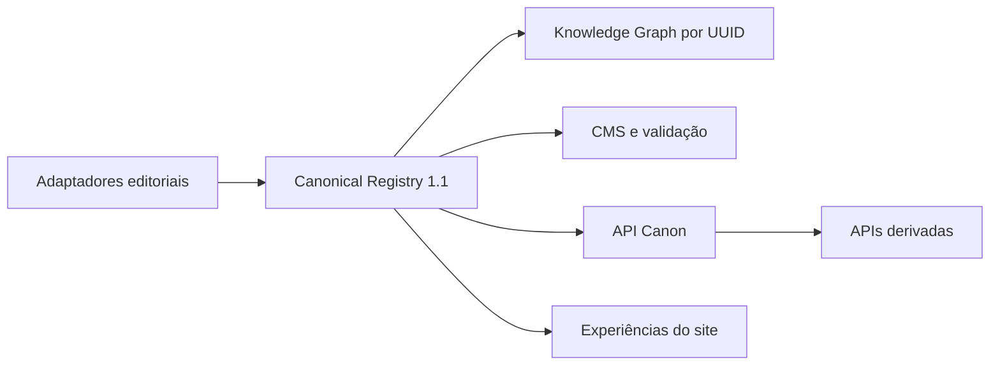

# Arquitetura do Canon

O registro cria UUIDs determinísticos a partir do tipo ontológico e slug. Aliases apontam para a identidade, relações usam IDs e todas as projeções mantêm compatibilidade com os slugs públicos.
